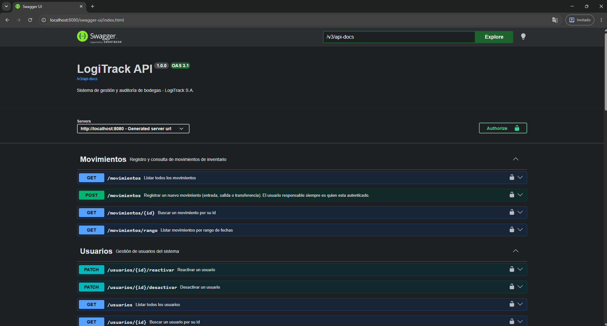
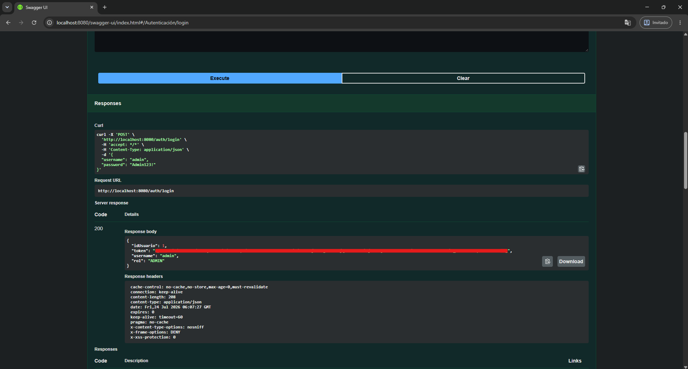
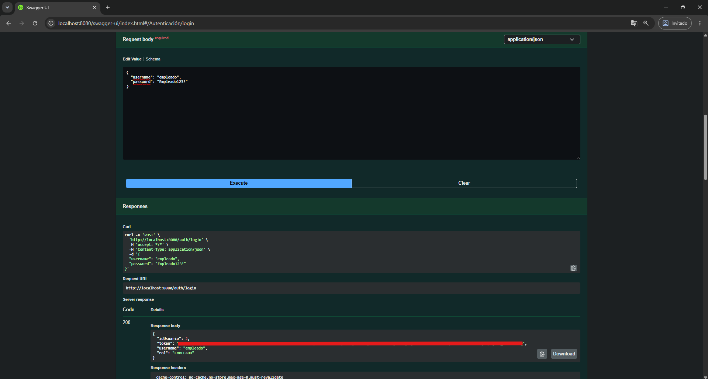
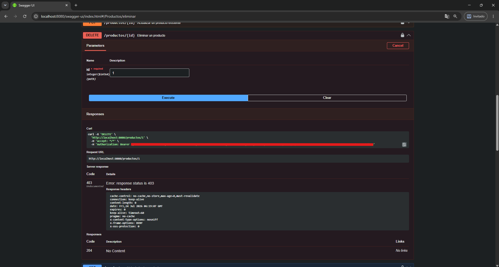
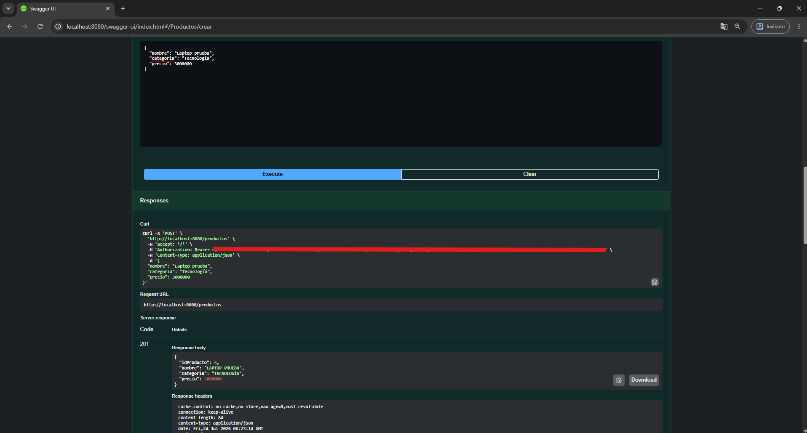
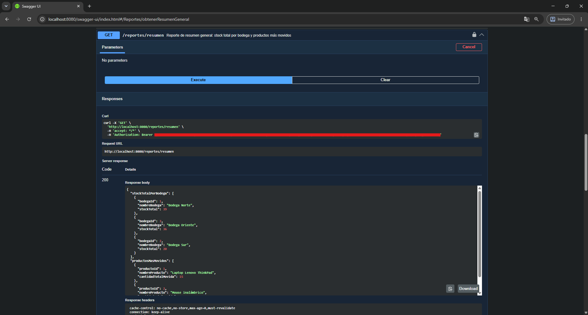
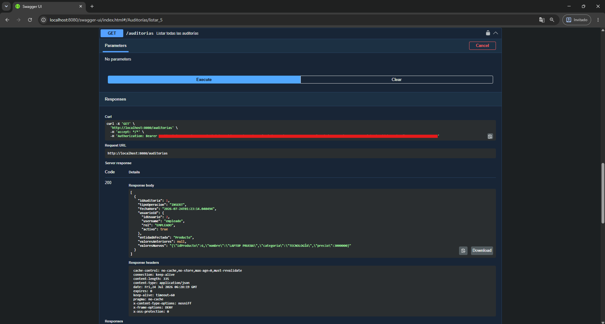
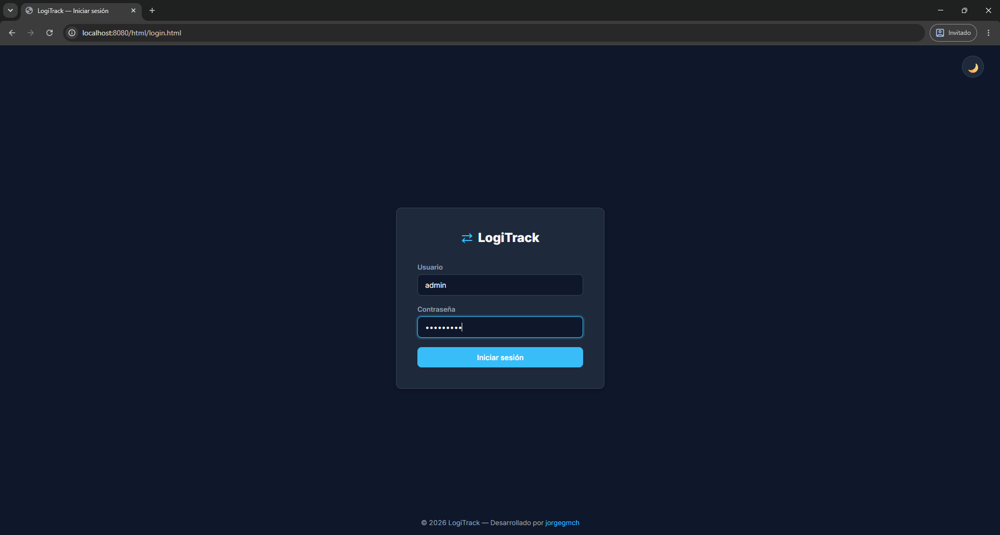
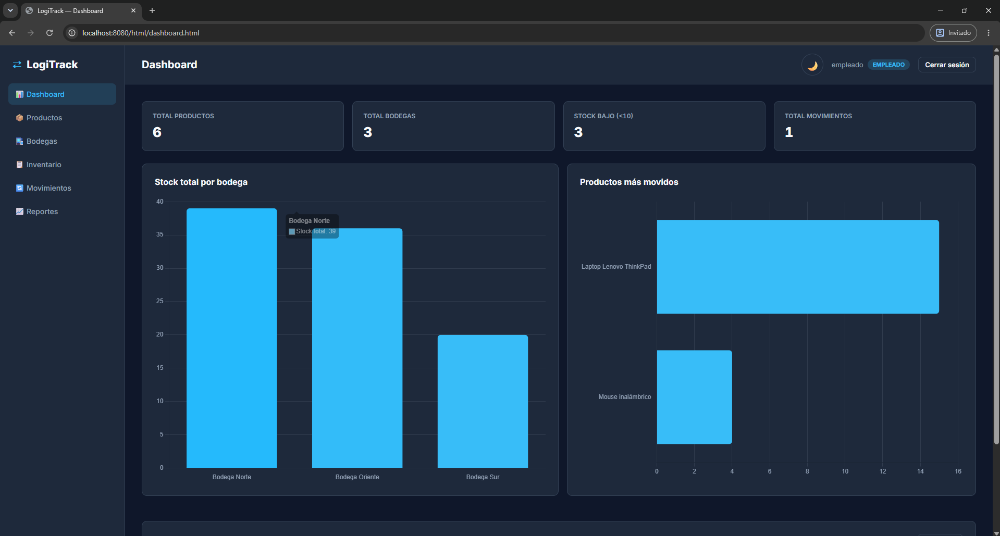

# LogiTrack API

Sistema de gestión y auditoría de bodegas desarrollado con **Spring Boot**. Permite controlar movimientos de inventario entre bodegas (entradas, salidas y transferencias), registrar automáticamente los cambios realizados por cada usuario mediante un sistema de auditoría, y proteger la información con autenticación **JWT** y control de acceso basado en roles.

---

## Tabla de contenido

- [Descripción del proyecto](#descripción-del-proyecto)
- [Tecnologías](#tecnologías)
- [Arquitectura y estructura del proyecto](#arquitectura-y-estructura-del-proyecto)
- [Instalación y ejecución](#instalación-y-ejecución)
- [Autenticación y roles](#autenticación-y-roles)
- [Documentación de la API (Swagger)](#documentación-de-la-api-swagger)
- [Ejemplos de endpoints](#ejemplos-de-endpoints)
- [Sistema de auditoría automática](#sistema-de-auditoría-automática)
- [Manejo de errores](#manejo-de-errores)
- [Frontend](#frontend)
- [Scripts SQL](#scripts-sql)
- [Testt realizados](#test-realizados)
- [Autor](#autor)

---

## Descripción del proyecto

LogiTrack S.A. administra varias bodegas distribuidas en distintas ciudades, encargadas de almacenar productos y gestionar movimientos de inventario. Este sistema centraliza esa operación, permitiendo:

- Controlar todos los movimientos entre bodegas (ENTRADA, SALIDA, TRANSFERENCIA).
- Registrar automáticamente cada cambio (INSERT, UPDATE, DELETE) realizado sobre las entidades principales, incluyendo quién lo hizo y qué valores cambiaron.
- Proteger todos los endpoints con autenticación JWT y control de acceso por rol (`ADMIN` / `EMPLEADO`).
- Ofrecer una API REST completamente documentada con Swagger/OpenAPI 3.
- Consumir la API completa desde un frontend propio en HTML/CSS/JS vanilla, con modo oscuro y claro.

## Tecnologías

| Componente | Tecnología |
|---|---|
| Lenguaje | Java 17 |
| Framework | Spring Boot 4.1.0 |
| Build tool | Maven |
| Base de datos | PostgreSQL (alojada en Supabase) |
| Seguridad | Spring Security + JWT (`io.jsonwebtoken`) |
| Documentación API | Springdoc OpenAPI 3 (Swagger UI) |
| Persistencia | Spring Data JPA / Hibernate |
| Frontend | HTML, CSS y JavaScript vanilla (sin frameworks) |
| Servidor | Tomcat embebido |

> **Nota sobre el despliegue:** la aplicación se ejecuta con el servidor **Tomcat embebido** que trae Spring Boot por defecto (`./mvnw spring-boot:run`).

## Arquitectura y estructura del proyecto

```
logitrack-api/
├── .vscode/
├── database/
│   ├── data.sql
│   └── schema.sql
├── docs/
│   ├── capturas/
│   └── documento-explicativo.pdf
├── src/
│   ├── main/
│   │   ├── java/com/jorgegmch/logitrack/
│   │   │   ├── config/          Configuración de seguridad, Swagger, ApplicationContextProvider
│   │   │   ├── controller/      Controladores REST
│   │   │   ├── dto/             DTOs de entrada y salida
│   │   │   ├── entity/          Entidades JPA (+ enums en entity/enums)
│   │   │   ├── exception/       Manejo global de errores
│   │   │   ├── listener/        Listener de auditoría automática (JPA @EntityListeners)
│   │   │   ├── repository/      Repositorios Spring Data JPA
│   │   │   ├── security/        JwtService, JwtAuthenticationFilter
│   │   │   ├── service/         Lógica de negocio
│   │   │   └── LogitrackApplication.java
│   │   └── resources/
│   │       ├── static/                          Frontend (servido directamente por Spring Boot)
│   │       │   ├── css/
│   │       │   ├── html/
│   │       │   ├── js/
│   │       │   └── index.html
│   │       ├── application.properties           (no versionado, ver instalación)
│   │       └── application.properties.example
│   └── test/
├── target/
├── .gitattributes
├── .gitignore
├── mvnw
├── mvnw.cmd
├── pom.xml
└── README.md
```

### Entidades principales

`Usuario`, `Bodega`, `Producto`, `InventarioBodega`, `Movimiento`, `DetalleMovimiento`, `Auditoria`, más los enums `Rol`, `TipoMovimiento` y `TipoOperacion`.

El **stock no es un atributo de `Producto`**: vive en `InventarioBodega`, ya que un mismo producto puede tener cantidades distintas según la bodega en la que se encuentre. El stock se gestiona exclusivamente a través del registro de movimientos.

## Instalación y ejecución

### Requisitos previos

- JDK 17
- Maven (o usar el wrapper `mvnw` incluido)
- Una base de datos PostgreSQL accesible (el proyecto fue desarrollado usando Supabase)

### 1. Clonar el repositorio

```bash
git clone https://github.com/jorgegmch/logitrack-api.git
cd logitrack-api
```

### 2. Configurar `application.properties`

El archivo `src/main/resources/application.properties` **no está versionado** (contiene credenciales sensibles). Se incluye `application.properties.example` como referencia. Crea tu propio `application.properties` con el siguiente contenido, reemplazando los valores según tu entorno:

```properties
spring.application.name=logitrack

# Base de datos
spring.datasource.url=jdbc:postgresql://<host>:6543/<basededatos>?prepareThreshold=0
spring.datasource.username=<usuario>
spring.datasource.password=<password>
spring.datasource.driver-class-name=org.postgresql.Driver

# Hibernate / JPA
spring.jpa.hibernate.ddl-auto=validate
spring.jpa.properties.hibernate.dialect=org.hibernate.dialect.PostgreSQLDialect
spring.jpa.properties.hibernate.default_schema=db_logitrack

# JWT
jwt.secret=<clave-secreta-base64>
jwt.expiration=86400000
```

> `ddl-auto=validate` se usa intencionalmente: el esquema se crea manualmente mediante `schema.sql`, evitando modificaciones automáticas y accidentales sobre una base de datos compartida.

### 3. Ejecutar los scripts SQL

Ejecuta, en orden, los scripts ubicados en `database/`:

1. `schema.sql` — crea el esquema `db_logitrack` y todas las tablas.
2. `data.sql` — carga datos iniciales, incluyendo dos usuarios de prueba.

**Usuarios precargados:**

| Username | Password | Rol |
|---|---|---|
| `admin` | `Admin123!` | ADMIN |
| `empleado` | `Empleado123!` | EMPLEADO |

### 4. Ejecutar la aplicación

```bash
./mvnw spring-boot:run
```

La aplicación queda disponible en `http://localhost:8080`.

### 5. Acceder al sistema

- **Frontend:** `http://localhost:8080/` (redirige automáticamente al login)
- **Swagger UI:** `http://localhost:8080/swagger-ui/index.html`

## Autenticación y roles

La autenticación es **stateless**, basada en tokens JWT firmados con HMAC-SHA. El flujo es:

1. `POST /auth/login` con `username` y `password` → devuelve un token JWT junto con `idUsuario`, `username` y `rol`.
2. El token se envía en cada petición protegida mediante el header `Authorization: Bearer <token>`.
3. Al expirar el token (24 horas desde su generación), el usuario debe volver a autenticarse.

### Roles del sistema

| Acción | ADMIN | EMPLEADO |
|---|---|---|
| Ver productos, bodegas, inventario, movimientos, reportes | ✅ | ✅ |
| Crear / actualizar productos | ✅ | ✅ |
| Eliminar productos | ✅ | ❌ |
| Crear / actualizar / eliminar bodegas | ✅ | ❌ |
| Registrar movimientos | ✅ | ✅ |
| Ver / gestionar usuarios | ✅ | ❌ |
| Registrar nuevos usuarios | ✅ | ❌ |
| Ver auditorías | ✅ | ❌ |

Al registrar un movimiento, el **usuario responsable siempre es quien está autenticado** — el backend lo resuelve internamente a partir del token, sin que pueda ser elegido ni sobrescrito desde el cliente. Esto protege la confiabilidad de la trazabilidad del sistema.

### Estructura del token JWT

Un JWT se compone de tres partes separadas por puntos: `header.payload.firma`. El **payload** (parte codificada dentro del token, no confundir con la respuesta JSON de `/auth/login`) contiene los siguientes *claims*, definidos en `JwtService.generarToken()`:

```json
{
  "sub": "admin",
  "rol": "ADMIN",
  "iat": 1753294400,
  "exp": 1755886400
}
```

- `sub`: username del usuario autenticado.
- `rol`: rol del usuario (`ADMIN` / `EMPLEADO`), usado por `JwtAuthenticationFilter` para construir las autoridades de Spring Security.
- `iat` / `exp`: fecha de emisión y expiración (timestamp Unix).

## Documentación de la API (Swagger)

Toda la API está documentada con Springdoc OpenAPI 3. Una vez la aplicación está corriendo:

```
http://localhost:8080/swagger-ui/index.html
```

Para probar endpoints protegidos: hacer login vía `POST /auth/login`, copiar el token de la respuesta, y usar el botón **Authorize** en la parte superior de Swagger, pegando `Bearer <token>`.

## Ejemplos de endpoints

### Autenticación

```http
POST /auth/login
Content-Type: application/json

{
  "username": "admin",
  "password": "Admin123!"
}
```

Respuesta:

```json
{
  "idUsuario": 1,
  "token": "eyJhbGciOiJIUzI1NiJ9...",
  "username": "admin",
  "rol": "ADMIN"
}
```

### Registrar un movimiento (ENTRADA)

```http
POST /movimientos
Authorization: Bearer <token>
Content-Type: application/json

{
  "tipo": "ENTRADA",
  "bodegaOrigenId": 1,
  "bodegaDestinoId": 2,
  "productoIds": [
    3
  ],
  "cantidades": [
    10
  ]
}
```

### Consultar productos con stock bajo

```http
GET /inventario/stock-bajo?limite=10
Authorization: Bearer <token>
```

### Consultar movimientos por rango de fechas

```http
GET /movimientos/rango?desde=2026-07-01T00:00:00&hasta=2026-07-31T23:59:59
Authorization: Bearer <token>
```

### Reporte de resumen general

```http
GET /reportes/resumen
Authorization: Bearer <token>
```

```json
{
  "stockTotalPorBodega": [
    { "bodegaId": 1, "nombreBodega": "Bodega Norte", "stockTotal": 39 }
  ],
  "productosMasMovidos": [
    { "productoId": 1, "nombreProducto": "Laptop Lenovo ThinkPad", "cantidadTotalMovida": 15 }
  ]
}
```

## Sistema de auditoría automática

Cada operación de creación, actualización o eliminación sobre `Producto`, `Bodega`, `Usuario` y `Movimiento` se registra automáticamente en la tabla `auditoria`, capturando:

- Tipo de operación (`INSERT`, `UPDATE`, `DELETE`)
- Fecha y hora
- Usuario que realizó la acción
- Entidad afectada
- Valores anteriores y nuevos (snapshot en JSON)

La implementación usa `@EntityListeners` de JPA (`AuditoriaListener`), combinado con `TransactionSynchronization.afterCommit()` y `@Transactional(propagation = Propagation.REQUIRES_NEW)`, garantizando que el registro de auditoría se guarde en una transacción independiente y confiable, después de que la operación original haya comprometido sus cambios exitosamente.

Consultable vía `GET /auditorias`, `GET /auditorias/usuario/{id}` y `GET /auditorias/tipo/{tipoOperacion}` (acceso exclusivo `ADMIN`).

## Manejo de errores

Centralizado mediante `@RestControllerAdvice` (`GlobalExceptionHandler`), devolviendo siempre una respuesta JSON consistente:

```json
{
  "timestamp": "2026-07-23T13:15:34.409648",
  "status": 404,
  "error": "Recurso no encontrado",
  "mensaje": "Producto no encontrado con id: 9999",
  "path": "/productos/9999"
}
```

| Excepción | Código HTTP |
|---|---|
| `RecursoNoEncontradoException` | 404 |
| `IllegalArgumentException` | 400 |
| `MethodArgumentNotValidException` (Bean Validation) | 400 |
| `BadCredentialsException` | 401 |
| `AccessDeniedException` | 403 |
| `Exception` (no controlada) | 500 |

## Frontend

Frontend propio en HTML, CSS y JavaScript vanilla (sin frameworks ni librerías de build), ubicado en `src/main/resources/static/`, servido directamente por Spring Boot.

**Páginas:**

- `login.html` — autenticación
- `dashboard.html` — resumen general con estadísticas y gráficos (Chart.js vía CDN)
- `productos.html` — CRUD de productos
- `bodegas.html` — CRUD de bodegas (creación/edición exclusiva ADMIN)
- `inventario.html` — consulta de stock, con filtro de stock bajo
- `movimientos.html` — registro y consulta de movimientos, con filtro por rango de fechas
- `usuarios.html` — gestión de usuarios (exclusivo ADMIN)
- `auditorias.html` — consulta de auditoría con filtros (exclusivo ADMIN)
- `reportes.html` — vista detallada del reporte de resumen general

**Características:**

- Modo oscuro (por defecto) y modo claro, alternables con un botón, con preferencia guardada por navegador.
- Interfaz completamente funcional contra la API real: cada operación disponible en el backend (crear, listar, actualizar, eliminar, filtrar) tiene su contraparte en el frontend, salvo aquellas restringidas por rol.
- Manejo de sesión vía `localStorage`, con redirección automática al login si el token expira o no existe.

## Scripts SQL

Ubicados en `database/`:

- **`schema.sql`** — crea el schema `db_logitrack` y las 7 tablas del sistema, con sus llaves foráneas, restricciones `CHECK` e índices.
- **`data.sql`** — datos iniciales: usuarios, bodegas, productos, inventario y un movimiento de ejemplo.

## Test realizados

Durante el desarrollo se verificaron manualmente, en Swagger y en el frontend, los siguientes escenarios:

- **Autenticación:** login exitoso, login con credenciales inválidas (401), registro de usuario como ADMIN (201) y como EMPLEADO (403).
- **CRUD y validaciones:** creación, actualización y eliminación de productos y bodegas; validación de campos obligatorios (400); consulta de un recurso inexistente (404).
- **Roles y permisos:** intento de eliminar un producto, crear una bodega y listar usuarios con el rol EMPLEADO, confirmando el rechazo (403) en cada caso; las mismas acciones exitosas con el rol ADMIN.
- **Consultas avanzadas:** productos con stock bajo, movimientos por rango de fechas, auditorías filtradas por usuario y por tipo de operación, reporte de resumen general.
- **Auditoría automática:** verificación de que cada operación INSERT/UPDATE/DELETE sobre Producto, Bodega, Usuario y Movimiento genera su registro correspondiente en `/auditorias`, con el usuario responsable y los valores anteriores/nuevos correctos.
- **Frontend:** flujo completo de login, navegación por las 9 vistas, operaciones CRUD desde la interfaz, alternancia de tema oscuro/claro, y verificación de que los controles restringidos por rol (botones de eliminar, módulo de usuarios, módulo de auditorías) se ocultan correctamente según el usuario autenticado.

### Muestra representativa de los test

**1. Swagger UI — documentación de la API**



**2. Autenticación — login exitoso**




**3. Manejo de errores y roles — acción restringida para empleado (403)**



**4. CRUD funcionando — ejemplo con productos**



**5. Consultas avanzadas — reporte de resumen general**



**6. Auditoría automática — registro generado**



**7. Frontend — Vista ADMIN**



**8. Frontend — vista ADMIN vs EMPLEADO**




## Documento explicativo

El documento con el diagrama de clases, la descripción de arquitectura y el ejemplo de uso del token JWT se encuentra en [`docs/documento-explicativo.pdf`](docs/documento-explicativo.pdf).

## Autor

**Jorge Gómez** — [github.com/jorgegmch](https://github.com/jorgegmch)